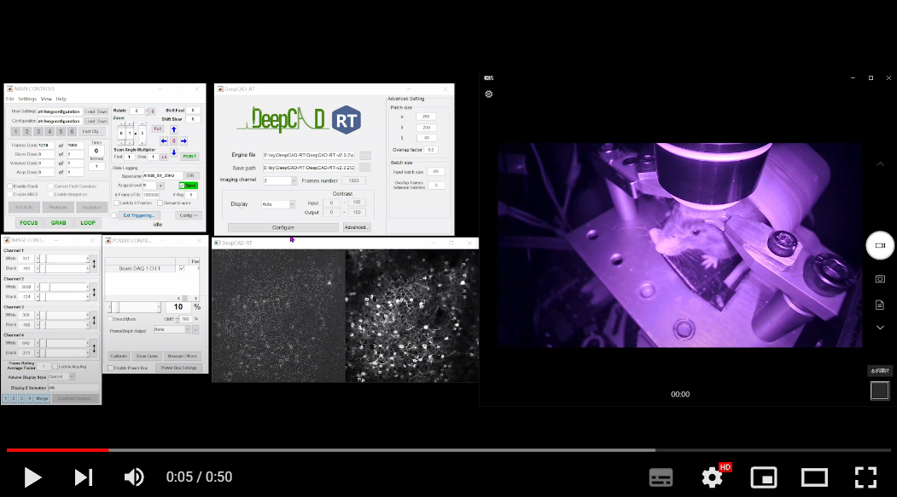

# Matlab implementation for real-time processing

To achieve real-time denoising, DeepCAD-RT was optimally deployed on GPU using TensorRT (Nvidia) for further acceleration and memory reduction. We also designed a sophisticated time schedule for multi-thread processing. Based on a two-photon microscope, real-time denoising has been achieved with our Matlab GUI of DeepCAD-RT (tested on a Windows desktop with Intel i9 CPU and 128 GB RAM).

<center></center> 

## Contents

- [Required environment](#required-environment)
- [File description](#file-description)
- [Instructions for use](#instructions-for-use)
- [Demo video](#demo-video)

## Required environment

- Windows 10
- CUDA 11.0
- CUDNN 8.0.5
- Matlab 2018a (or newer version)
- Visual Studio 2017

## File description

`deepcad_trt.m`: Matlab script that calls fast processing and tiff saving function programmed in C++

`deepcad_trt_nosave.m`: Matlab script that calls fast processing function programmed in C++ and save tiff in Matlab

`realtime_core.m`: Realtime simulation in Matlab & C++ and save tiff

`DeepCAD-RT-v2.x.x/DeepCAD-RT-v2/deepcad/+deepcadSession`: Real-time inference with data flow from ScanImage

`DeepCAD-RT-v2.x.x/DeepCAD-RT-v2/results`: Path to save result images

`DeepCAD-RT-v2.x.x/DeepCAD-RT-v2/engine_file`: Path for the engine file

## Instructions for use

### Install

1. Download the `.exe` file from [here](https://doi.org/10.5281/zenodo.6352526). When you double click this self-extracting file, the relevant files of DeepCAD-RT will unzip to the location that you choose.

2. Copy the `.dll` files from `<installpath>/DeepCAD-RT-v2.x.x/dll` to your CUDA installation directory, for example `C:\Program Files\NVIDIA GPU Computing Toolkit\CUDA\v11.0\bin`. The CUDA installer should have already added the CUDA path to your system PATH (from [TensorRT installation guide](https://docs.nvidia.com/deeplearning/tensorrt/archives/tensorrt-601/tensorrt-install-guide/index.html#installing-zip)).

### Model preparation

   After [training](https://github.com/cabooster/DeepCAD-RT#demos), the ONNX files will be saved in `DeepCAD-RT/DeepCAD_RT_pytorch/onnx`. In order to reduce latency, `patch_t` should be decreased. **The recommended patch size is 200x200x40 pixels.**

   We provide two pre-trained ONNX models in `DeepCAD-RT-v2.x.x/DeepCAD-RT-v2` . The patch size of `cal_mouse_mean_200_40_full.onnx` and `cal_mouse_mean_200_80_full.onnx` are 200x200x40 pixels and 200x200x80 pixels, respectively. The calcium imaging data used for training these model were captured by our customized two-photon microscope:

​    *Key imaging parameters of training data:*

- *30Hz sampling rate, 500x500 μm2 field of view, 490x490 pixels.*
- *The imaging depth is ranging from 40 to 180 um.*
- *The imaging power is ranging from 66 to 99 mW.*

### Real-time inference with ScanImage

<center></center> 

Matlab configuration:

1. Open Matlab.

2. Change file path to `<installpath>/DeepCAD-RT-v2.x.x/DeepCAD-RT-v2`.

3. Configure the environment:

   ```
   mex -setup C++
   
   installDeepCADRT
   ```

4. Open ScanImage and DeepCAD_RT GUI:

   ```
   scanimage
   
   DeepCAD_RT 
   ```

5. Set the parameters in GUI:

   `Model file`: The path of the ONNX file.  Click `...` to open the file browser and choose the file used for inference.

   `Save path`:The path to save denoised images. Click `...` to open the file browser and choose the path

   `Frame number`: How many frames to acquire. It is equal to the value set in ScanImage. This parameter will update automatically when you click `Configure`. 

   <center></center>

   **Attention: You should set the frame number before clicking `Configure`.**

   `Display setting`: 

   `Manual` mode: You can set the minimum and maximum intensity for image display.

   `Auto` mode: The contrast will be set automatically but slightly slower than `Manual` mode.

   `Advanced`: Advanced settings.

   `Patch size (x,y,t)`: The three parameters depend on the patch size you set in the training process.

   `Overlap factor`: The overlap factor between two adjacent patches. The recommended number is between 0.125 and 0.4. Larger overlap factor means better performance but lower inference speed.

   `Input batch size`: The number of frames per batch. The recommended value is between 50 and 100. It should be larger than the patch size in t dimension.

   `Overlap frames between batches`: The number of overlapping slices between two adjacent batches. The recommended value is between 5 and 10. More overlapping frames lead to better performance but lower inference speed.

6. After set all parameters, please click `Configure`. If you click `Configure` for the first time, the initialization program will execute automatically.

7. You can click `GRAB` in ScanImage and start imaging.

8. Before each imaging session, you should click  `Configure`.

## Demo video


[](https://www.youtube.com/embed/u1ejSaVvWiY "Video Title")

